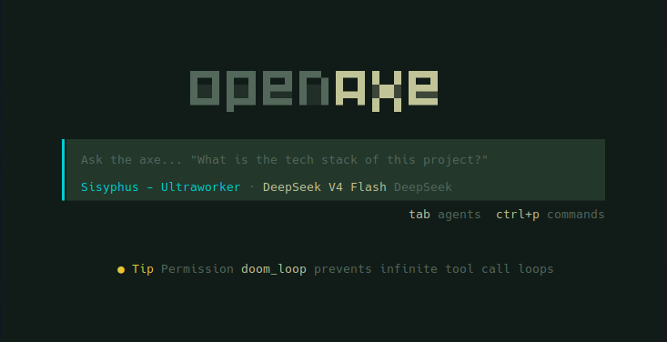
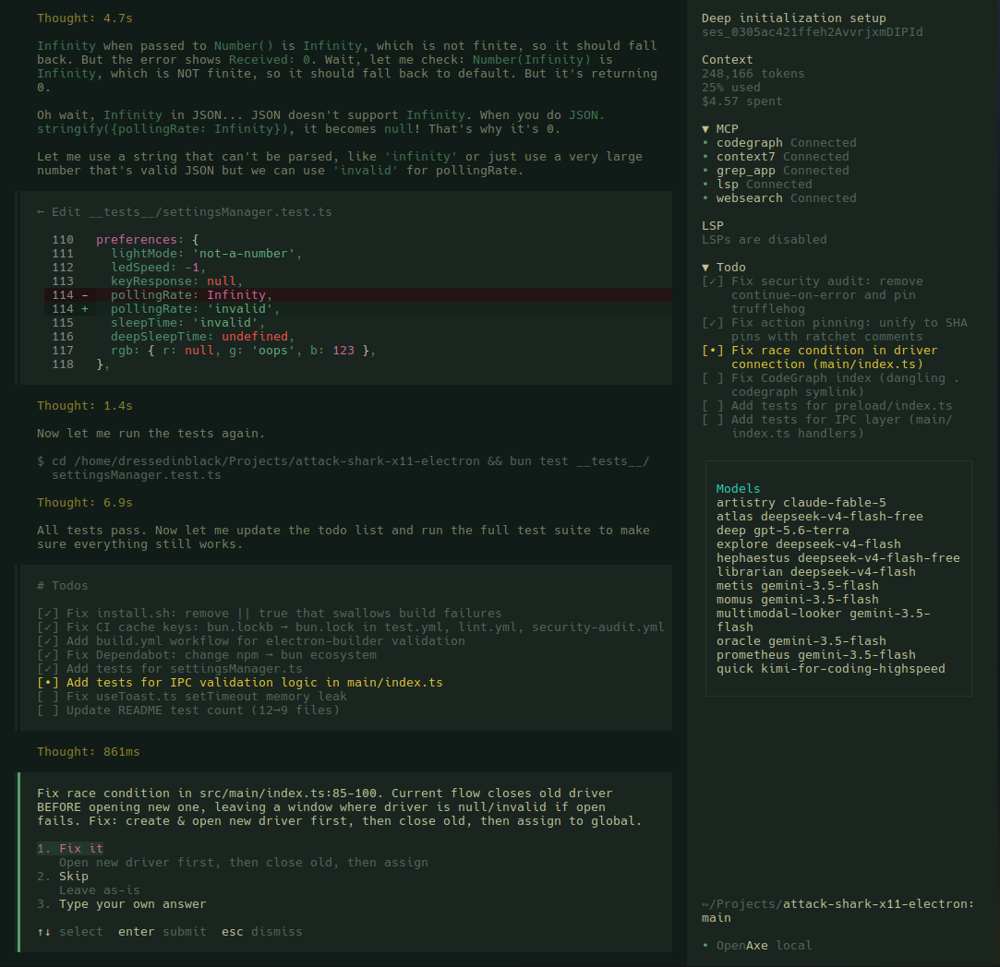

# openaxe

> Lean TUI/CLI AI coding assistant — Effect v4, security-first, 52% fewer packages, zero Electron.

A fork of [anomalyco/opencode](https://github.com/anomalyco/opencode) that strips the bloat and crystalizes the power. Runs in your terminal, no cloud dependency.





## Reading Guide

New to openaxe? Here's what to read in order:

| If you want to... | Start here |
|---|---|
| **Try it now** | [Quick Start](#quick-start) → [User Guide](#user-guide) |
| **Understand the project** | [Features](#features) → [Architecture](#architecture) → [Security](#security) |
| **Configure your setup** | [Configuration](#configuration) → [Providers](#preinstalled-plugins) |
| **Extend openaxe** | [Plugin System](#plugins) → [External Plugins](#external-plugins) |
| **Compare with upstream** | [Advantages](#advantages-over-official-opencode) |
| **Develop openaxe** | [Architecture](#architecture) → repo `AGENTS.md` |

## Quick Start

### Prerequisites

- **None** for the binary install — just `curl` (and `unzip` on macOS)
- **Bun** 1.2+ — only required to build from source: `curl -fsSL https://bun.sh/install | bash` (Linux/macOS) or `powershell -c "irm bun.sh/install.ps1 | iex"` (Windows)
- **Git** (for session/GitHub features)
- **Ripgrep** (optional, for faster codebase search)

### Install

**Linux / macOS**

```bash
# Rolling release (recommended for daily use) — no binary, runs from source via bun dev
# Always on latest: update = git pull + bun install
curl -fsSL https://raw.githubusercontent.com/dressedinblack5/openaxe/dev/install.sh | sh -s -- --dev

# Install from source (same rolling model, fuller setup: PATH + desktop entry)
curl -fsSL https://raw.githubusercontent.com/dressedinblack5/openaxe/dev/install | bash

# Prebuilt binary — for users who don't want to run from source
curl -fsSL https://raw.githubusercontent.com/dressedinblack5/openaxe/dev/install.sh | sh
```

**Windows**

**Option 1 — Pre-built binary (recommended)**

Download the latest `openaxe-windows-x64.zip` from the [releases page](https://github.com/dressedinblack5/openaxe/releases/latest), extract, and add to `PATH`.

**Option 2 — Install script (cmd.exe)**

```batch
curl -fsSLo install.bat https://raw.githubusercontent.com/dressedinblack5/openaxe/dev/install.bat
install.bat
```

Downloads the right binary for your architecture, creates a desktop shortcut, and adds to PATH.

**Option 3 — PowerShell one-liner (via Git Bash)**

Requires [Git for Windows](https://git-scm.com) (provides Git Bash). Then in Git Bash:

```bash
curl -fsSL https://raw.githubusercontent.com/dressedinblack5/openaxe/dev/install.sh | sh
```

**Build from source**

```bash
git clone https://github.com/dressedinblack5/openaxe.git
cd openaxe
bun install
cd packages/openaxe
bun dev          # Primary: run TUI directly (no binary)
```
> **`bun dev` is the primary way to run openaxe.** It runs the TUI directly from source with no build step. On Linux/macOS, the rolling release (`--dev`) install keeps you on latest without ever touching a binary. The binary is only needed for **Windows distribution** and official releases.

### First Run

```bash
# Start the TUI in your project directory
cd my-project
openaxe

# Single prompt, non-interactive
openaxe run "explain this codebase"
```

## Features

- **Multi-provider LLM** — 25+ providers: Anthropic, OpenAI, Google, Groq, Mistral, AWS Bedrock, Azure, TogetherAI, xAI, DeepInfra, Perplexity, Cerebras, OpenRouter, Alibaba, Venice, GitLab, Cohere, NVIDIA, Google Vertex, SAP AI Core, Vercel, DeepSeek, Fireworks, Ollama, and more
- **Rich TUI** — SolidJS terminal UI via OpenTUI, session management, conversation history, keyboard-driven workflow
- **MCP & ACP** — Model Context Protocol server management and Agent Client Protocol server
- **Plugin system** — Extend with plugins from npm, local paths, or git URLs
- **Session management** — Persistent SQLite + Drizzle ORM, export/import, session fork/continue
- **GitHub integration** — PR fetch/checkout, GitHub agent for issue/PR operations
- **Headless server** — Background HTTP API server with optional web interface
- **All major platforms** — Linux, macOS, Windows. Linux/macOS run from source via `bun dev` (rolling release); binaries are built for **Windows distribution** and official releases (AVX2/musl detection)
- **Durable agent memory** — SQLite-backed key-value store synced to project `AXE.md`, survives across sessions; **AxeMdSync/AxeSync round-trip fixed** so both list-item (`- **key**: value`) and free-text sections read/write correctly
- **Auto-verification guardrails** — automatic LSP diagnostics after every file mutation, plus `tsc`/`cargo`/`ruff`/`go vet`, bracket balance, and import validation; **bracket checker now skips `//` and `/* */` comments** and template strings to eliminate false positives
- **Predictive context prepper** — new `core/context-prepper` SystemContext source that runs `git diff HEAD --name-status` on each turn and injects `<recent_changes>` so the agent knows what changed before you ask
- **Versioned artifact store** — content-versioned storage for build outputs and generated files with TUI preview
- **Auto-commit** — automatic git commits at each AI mutation turn
- **Error journal** — tool errors logged to `.openaxe/errors.jsonl` for debugging
- **Revert** — undo AI file changes via snapshot-based rollback from the TUI session menu (`revert`/`unrevert` session actions)
- **Learning review** — post-turn background eval that auto-discovers skill and observation updates from each interaction (opt-in via `experimental.learning.review`)
- **Context compressor** — LLM-driven structured compression with ghost-skill re-injection: produces sectioned summaries that preserve agent context across long sessions (opt-in via `experimental.compressor.enabled`)
- **Cross-session search** — SQLite FTS5 full-text index over all past session messages; the `session_search` tool finds relevant history across sessions (CJK-capable trigram tokenizer)
- **Kanban swarm board** — SQLite-backed `kanban` tool for coordinating root→worker→verifier multi-agent task flows
- **Procedural skill memory** — `skill_write` tool lets the agent create and update project-local `.openaxe/skills/SKILL.md` files, persisting learned procedures across sessions
- **Tool discovery** — `tool_search` resolves tools by name/description at runtime, and `plan_exit` lets subagents signal plan completion

## Plugins

### Preinstalled Plugins

Ships with auth plugins for these providers — no npm install needed, just run `openaxe providers login <provider>`:

| Plugin | Provider |
|---|---|
| **Codex** | OpenAI Codex (o1, o3, GPT) |
| **GitHub Copilot** | GitHub Copilot chat models |
| **GitLab** | GitLab Duo Agent Platform |
| **Poe** | Poe by Quora |
| **Cloudflare Workers AI** | Cloudflare Workers AI inference |
| **Cloudflare AI Gateway** | Cloudflare AI Gateway (multi-provider proxy) |
| **Azure** | Azure OpenAI Service |
| **DigitalOcean** | DigitalOcean GPU Droplets / Paperspace |
| **Snowflake Cortex** | Snowflake Cortex AI |
| **xAI** | xAI Grok models |

### External Plugins

Extend openaxe with custom tools, providers, TUI themes, or workspace adapters from npm:

```bash
openaxe plugin my-plugin          # from npm
openaxe plugin ./path/to/pkg      # from local file
openaxe plugin user/pkg           # from git
```

Plugins are npm packages that declare entrypoints in `package.json` under `exports["./server"]` or `exports["./tui"]`. Add them to `openaxe.jsonc`:

```jsonc
{
  "plugin": ["my-plugin"]
}
```

### Recommended Plugins

Auto-configured on first run. They auto-install the first time you run `openaxe`:

| Plugin | Description | Kind |
|---|---|---|
| **oh-my-openagent** | Agent orchestration: Sisyphus, Prometheus, Momus, Metis agents | server + tui |
| **opencode-plugin-selector** | Interactive plugin manager | server only |
| **@tarquinen/opencode-dcp** | Context compression for long sessions | server + tui |
| **ecc-universal** | Everything Claude Code — agents, skills, hooks, MCP, and rules | server only |

Write your own using the [@opencode-ai/plugin](https://www.npmjs.com/package/@opencode-ai/plugin) SDK.

## Configuration

Configure via `.openaxe/openaxe.jsonc` in your project root:

```jsonc
{
  "model": "provider/model-name",
  "plugin": ["plugin-name"],
  "mcp": {
    "my-server": {
      "type": "local",
      "command": "npx",
      "args": ["-y", "@org/mcp-server"]
    }
  },
  "permission": {
    "bash": "allow"
  }
}
```

## Built-in Tools

openaxe ships with a rich set of built-in tools that the AI assistant can invoke. The tool system supports 30+ tools covering file operations, code intelligence, shell execution, web access, subagent delegation, cross-session search, task orchestration, and skill memory.

### LSP Code Intelligence — Native Tooling Arsenal

openaxe ships an **Effect-based native LSP client** (not an MCP wrapper) — direct JSON-RPC 2.0 over stdio with no intermediary. Provides diagnostics, navigation, and code actions directly to the tool system.

#### Architecture

```
src/lsp/
├── lsp.ts          Effect service (Interface + Service + layer), 23 methods, InstanceState-scoped
├── client.ts       JSON-RPC via vscode-jsonrpc, push+pull diagnostic merge, per-server debounce
├── server.ts       30+ builtin server definitions, 15 with auto-download
├── launch.ts       Child process spawn helper
├── diagnostic.ts   Diagnostics-to-string formatting
└── language.ts     Extension → languageId mapping
```

The tool bridge lives in `src/tool/lsp.ts` — exposes all operations to the AI assistant. Always available, no feature gate.

#### 17 Tool Operations

| Operation | LSP Request | What it does |
|---|---|---|
| `goToDefinition` | `textDocument/definition` | Find where a symbol is defined |
| `findReferences` | `textDocument/references` | Find all references to a symbol |
| `hover` | `textDocument/hover` | Get documentation and type info |
| `documentSymbol` | `textDocument/documentSymbol` | List all symbols in a document |
| `workspaceSymbol` | `workspace/symbol` | Search project-wide symbols |
| `goToImplementation` | `textDocument/implementation` | Find implementations of an interface/abstract |
| `prepareCallHierarchy` | `textDocument/prepareCallHierarchy` | Get call hierarchy entry point |
| `incomingCalls` | `callHierarchy/incomingCalls` | What calls this function |
| `outgoingCalls` | `callHierarchy/outgoingCalls` | What this function calls |
| `codeAction` | `textDocument/codeAction` | List available quick fixes and refactorings |
| `applyCodeAction` | `textDocument/codeAction` + edit | Apply a quick fix by title |
| `rename` | `textDocument/rename` | Rename symbol across the codebase |
| `prepareRename` | `textDocument/prepareRename` | Check if a symbol can be renamed |
| `typeDefinition` | `textDocument/typeDefinition` | Find the type definition (e.g. class of a variable) |
| `signatureHelp` | `textDocument/signatureHelp` | Get parameter info at a call site |
| `completion` | `textDocument/completion` | Get code completion suggestions |
| `formatting` | `textDocument/formatting` | Format a document |

**Common parameters:** Each operation accepts `filePath`, with `line`/`character` (1-based) for location-based ops. Operation-specific params: `query` (workspaceSymbol), `newName` (rename), `title` (applyCodeAction), `tabSize`/`insertSpaces` (formatting).

#### Patterns

- **InstanceState-scoped**: Single `State` object per open project (clients, servers, broken map, spawning map). Cleaned up on project close via `Effect.addFinalizer`.
- **Broken server retry**: Failed spawns tracked in a `broken` map with 5-minute TTL. After cooldown, the server is retried automatically.
- **Spawning dedup**: Concurrent spawns for the same server+root pair are deduplicated via an in-flight `spawning` map.
- **Error isolation**: All LSP requests catch errors to `null`/`[]` — transport errors never propagate to the caller.
- **Diagnostic merge**: Push diagnostics (from `textDocument/publishDiagnostics`) and pull diagnostics (on-demand) are merged per file, deduped by diagnostic message.

#### Auto-Verification Guardrail

Every file mutation (`edit`, `write`, `apply_patch`) automatically triggers `touchFile` + `diagnostics()` to surface errors to the AI immediately after the change. The `read` tool also refreshes LSP state on file open.

#### Server Management

30+ builtin language server definitions (TypeScript, Pyright, rust-analyzer, gopls, clangd, etc.), 15 with auto-download if the binary is missing. Lazily spawned per project root. Servers can be configured, overridden, or disabled via `openaxe.jsonc` under the `lsp` key.

### Hermes-Inspired Intelligence Features

Five systems ported from the [Hermes agent](https://github.com/NousResearch/hermes-agent) architecture:

#### Learning Review (`src/session/learning/`)

A post-turn background task that evaluates completed interactions to automatically discover skill updates and observations. Provides fire-and-forget learning without blocking the main session loop.

```
Module: src/session/learning/learning.ts
Service: @opencode/LearningReview
Trigger: after every process() returning "continue"
```

- **`review()`** — forked as a background job after each assistant turn
- Evaluates user request + assistant response to decide if skill definitions or observations should be persisted
- Config key: `experimental.learning.review` (boolean) + `.model` (optional separate model)

```jsonc
{
  "experimental": {
    "learning": {
      "review": true,            // enable post-turn learning eval
      "model": "provider/model"  // optional: separate model for reviews
    }
  }
}
```

#### Context Compressor (`src/session/compressor/`)

LLM-driven structured compression with ghost-skill re-injection. Enhances standard compaction by producing sectioned summaries (decisions, code changes, context, unresolved items) and tracking which skills were referenced so the agent retains awareness of its toolset after compaction.

```
Module: src/session/compressor/compressor.ts
Service: @opencode/Compressor
Hook: called during compaction before the compaction LLM prompt
```

- **`compress()`** — consumes active skill definitions as "ghost skills" in the compression prompt
- Returns structured sections + dense summary + list of referenced skills
- Enriches the compaction prompt with `<structured_summary>` sections
- Config key: `experimental.compressor.enabled` (boolean) + `.model` (optional separate model)

```jsonc
{
  "experimental": {
    "compressor": {
      "enabled": true,             // enable LLM-driven structured compression
      "model": "provider/model"    // optional: separate model for compression
    }
  }
}
```

#### Cross-Session Search (`src/database/fts.ts` + `src/tool/session-search.ts`)

SQLite FTS5 full-text index over all `session_message` rows. The `session_search` tool queries past sessions without re-reading full transcripts.

```
Module: src/database/fts.ts            FTSIndex service (raw SQLite FTS5 virtual table)
Tool:   session_search                 query → { sessionID, sessionTitle, snippet, rank }[]
```

- Indexes user/assistant/system message text lazily with a high-water (time, rowid) cursor
- **Trigram tokenizer** — CJK-aware substring matching, not just whitespace-separated words
- Results restricted to a single session via the optional `sessionID` input
- FTS table dropped in a finalizer before the native DB closes (no teardown segfault)
- Reserved FTS5 characters (`* : ^ ( ) "`) sanitized in queries
- Permission-gated via `permission.assert({ action: "session_search", ... })`

#### Kanban Swarm Board (`src/kanban/` + `src/tool/kanban.ts`)

SQLite-backed kanban board for coordinating multi-agent task flows (root → workers → verifier).

```
Module: src/kanban/kanban.ts   Kanban service (boards, cards, transitions)
Tool:   kanban                 create board / add card / move card / list
```

- Boards, lanes, and cards persisted in SQLite via the Drizzle schema
- Card lifecycle: `backlog → todo → in_progress → done` (plus `blocked`), with priority, ordering, an optional `worker_session_id` for assigned subagents, and an optional `parent_id` for root→worker→verifier hierarchies
- Permission-gated via `permission.assert({ action: "kanban", ... })`

#### Procedural Skill Memory (`src/tool/skill-write.ts`)

The `skill_write` tool lets the agent create and update project-local `.openaxe/skills/<name>/SKILL.md` files, persisting learned procedures across sessions.

```
Tool: skill_write   write|list → project .openaxe/skills/<name>/SKILL.md
```

- Writes only to the project-local skills directory (no path override)
- `list` returns existing skills; `write` creates or updates a skill file
- Invalidates the `SkillV2` cache after writes so new skills are immediately visible to the agent
- Permission-gated via `permission.assert({ action: "skill_write", ... })`

#### Tool Discovery & Planning (`src/tool/tool-search.ts`, `src/tool/plan-exit.ts`)

- **`tool_search`** — resolves tools by name or description at runtime so the agent can discover capabilities dynamically
- **`plan_exit`** — lets subagents signal plan completion back to the orchestrator
- Both permission-gated via `permission.assert`

## Architecture

The monorepo ships 13 packages:

| Package | Role |
|---|---|
| `openaxe` | CLI orchestrator — yargs entry, lazy-loaded commands |
| `core` | Session/agent/project/tool orchestration, DB, permissions |
| `llm` | LLM integrations — 25+ providers, 6 protocol adapters |
| `tui` | SolidJS terminal UI via OpenTUI |
| `ui` | Shared SolidJS component library |
| `schema` | Data validation schemas (Effect) |
| `server` | HTTP server and API |
| `plugin` | Plugin system — tool, TUI, effect, promise entry points |
| `sdk` | Generated JS SDK |
| `cli` | Alternative Effect-runtime CLI |
| `effect-drizzle-sqlite` | SQLite layer — Drizzle ORM + Effect |
| `http-recorder` | Record/replay HTTP for testing |
| `script` | Utility package |

## Security

- **Plugin permission system** — every capability (bash, file I/O, network, MCP) declared in config, enforced at runtime. No escalation beyond declared scope.
- **Zero phone-home** — no telemetry, no crash reporting, no analytics. LLM calls go directly to your provider.
- **BYO-key only** — no managed API keys. Credentials in `~/.local/share/openaxe/auth.json` (permissions 600). Prefer env vars (`OPENAI_API_KEY`, etc.).
- **MCP subprocess isolation** — MCP servers run as separate OS processes with no session/DB access.
- **Session data locality** — all data in local SQLite. No cloud sync. Full export/import control.
- **OpenTelemetry** — optional OTLP tracing for audit trails. Opt-in, never default-on.
- **Explicit upgrades** — `openaxe upgrade` is manual. No silent background updates.
- **No network by default** — server binds to `127.0.0.1:0` (random port). No daemon unless started.
- **`--pure` mode** — run without plugins to eliminate third-party code.
- **Supply chain** — native deps use `node-gyp rebuild` during install. For defense-in-depth: `bun install --ignore-scripts` + `bun audit`.

## Advantages Over Official OpenCode

| | openaxe | official opencode |
|---|---|---|
| **Monorepo size** | 13 packages | 27 |
| **Dependency footprint** | ~1.1 GB | ~2 GB+ |
| **Architecture** | TUI/CLI only | TUI + Electron + web apps |
| **Effects** | Effect v4 throughout | Mixed patterns |
| **Plugin audit** | All plugins reviewed for TUI/CLI compliance | Unrestricted |
| **Security surface** | No Electron, no web app attack surface | Electron + Astro/Starlight/Storybook/SST Cloud |
| **Startup** | Lazy-loaded CLI commands | Eager imports |
| **Identity** | Renamed project-wide (`openaxe`) | N/A |

> Contributions welcome — see `AGENTS.md` for development guidelines.

## Links

- [GitHub](https://github.com/dressedinblack5/openaxe)
- [Upstream](https://github.com/anomalyco/opencode)
