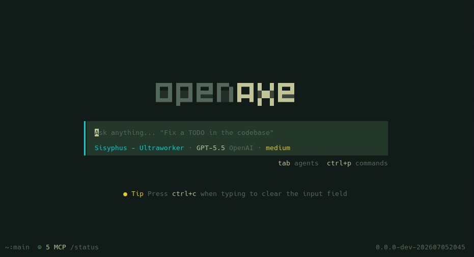

# openaxe

> Lean TUI/CLI AI coding assistant — Effect v4, security-first, 52% fewer packages, zero Electron.

A fork of [anomalyco/opencode](https://github.com/anomalyco/opencode) that strips the bloat and keeps the power. Runs in your terminal, no cloud dependency.



## Reading Guide

New to openaxe? Here's what to read in order:

| If you want to... | Start here |
|---|---|
| **Try it now** | [Quick Start](#quick-start) → [User Guide](#user-guide) |
| **Understand the project** | [Features](#features) → [Architecture](#architecture) → [Security](#security) |
| **Configure your setup** | [Configuration](#configuration) → [Providers](#preinstalled-plugins) |
| **Extend openaxe** | [Plugin System](#plugins) → [External Plugins](#external-plugins) |
| **Compare with upstream** | [Advantages](#advantages-over-official-opencode) |
| **Develop openaxe** | [Architecture](#architecture) → repo `AGENTS.md` |

## Quick Start

### Prerequisites

- **Bun** 1.2+ — install via `curl -fsSL https://bun.sh/install | bash` (Linux/macOS) or `powershell -c "irm bun.sh/install.ps1 | iex"` (Windows)
- **Git** 2.30+ (for session/GitHub features)
- **Ripgrep** (optional, for faster codebase search)

### Install

**Linux / macOS**

```bash
# Preferred — one-liner
curl -fsSL https://raw.githubusercontent.com/dressedinblack5/openaxe/main/install | bash
```

**Windows**

Download the latest `openaxe-windows-x64.zip` from the [releases page](https://github.com/dressedinblack5/openaxe/releases/latest), extract, and add to `PATH`.

**Build from source**

```bash
git clone https://github.com/dressedinblack5/openaxe.git
cd openaxe
bun install
bun run --cwd packages/openaxe src/index.ts
```

### First Run

```bash
# Start the TUI in your project directory
cd my-project
openaxe

# Run a single prompt, non-interactive
openaxe run "explain this codebase"
```

## Features

- **Multi-provider LLM** — 15+ providers: Anthropic, OpenAI, Google, Groq, Mistral, AWS Bedrock, Azure, TogetherAI, xAI, DeepInfra, Perplexity, Cerebras, OpenRouter, Alibaba, Venice, GitLab, and more
- **Rich TUI** — SolidJS terminal UI via OpenTUI, session management, conversation history, keyboard-driven workflow
- **MCP & ACP** — Model Context Protocol server management and Agent Client Protocol server
- **Plugin system** — Extend with plugins from npm, local paths, or git URLs
- **Session management** — Persistent SQLite + Drizzle ORM, export/import, session fork/continue
- **GitHub integration** — PR fetch/checkout, GitHub agent for issue/PR operations
- **Headless server** — Background HTTP API server with optional web interface
- **All major platforms** — Linux, macOS, Windows (native binaries, AVX2/musl detection)

## User Guide

```bash
openaxe --help
```

### Core

| Command | Description |
|---|---|
| `openaxe` [project] | Start the TUI (default) |
| `openaxe run <message>` | Run with a prompt, non-interactive |
| `openaxe serve` | Start headless server |
| `openaxe web` | Start server with web UI |
| `openaxe attach <url>` | Attach to a running server |

### Providers & Models

| Command | Description |
|---|---|
| `openaxe providers` | Manage AI providers & credentials |
| `openaxe models` | List available models |
| `openaxe agent` | Manage agents |

### Sessions & Data

| Command | Description |
|---|---|
| `openaxe session` | Manage sessions |
| `openaxe stats` | Session statistics |
| `openaxe export` / `import` | Session data portability |
| `openaxe db` | Database tools |

### Extensions

| Command | Description |
|---|---|
| `openaxe mcp` | Manage MCP servers |
| `openaxe acp` | Start ACP server |
| `openaxe plugin` | Install/manage plugins |
| `openaxe github` | GitHub agent |
| `openaxe pr <number>` | Fetch and checkout a PR, then run openaxe |

### System

| Command | Description |
|---|---|
| `openaxe debug` | Debugging and troubleshooting |
| `openaxe upgrade` | Upgrade openaxe |
| `openaxe uninstall` | Uninstall and remove all files |

## Plugins

### Preinstalled Plugins

Ships with auth plugins for these providers — no npm install needed, just run `openaxe providers login <provider>`:

| Plugin | Provider |
|---|---|
| **Codex** | OpenAI Codex (o1, o3, GPT) |
| **GitHub Copilot** | GitHub Copilot chat models |
| **GitLab** | GitLab Duo Agent Platform |
| **Poe** | Poe by Quora |
| **Cloudflare Workers AI** | Cloudflare Workers AI inference |
| **Cloudflare AI Gateway** | Cloudflare AI Gateway (multi-provider proxy) |
| **Azure** | Azure OpenAI Service |
| **DigitalOcean** | DigitalOcean GPU Droplets / Paperspace |
| **Snowflake Cortex** | Snowflake Cortex AI |
| **xAI** | xAI Grok models |

### External Plugins

Extend openaxe with custom tools, providers, TUI themes, or workspace adapters from npm:

```bash
openaxe plugin my-plugin          # from npm
openaxe plugin ./path/to/pkg      # from local file
openaxe plugin user/pkg           # from git
```

Plugins are npm packages that declare entrypoints in `package.json` under `exports["./server"]` or `exports["./tui"]`. Add them to `openaxe.jsonc`:

```jsonc
{
  "plugin": ["my-plugin"]
}
```

### Recommended Plugins

Auto-configured on first run. They auto-install the first time you run `openaxe`:

| Plugin | Description |
|---|---|
| **oh-my-openagent** | Agent orchestration: Sisyphus, Prometheus, Momus, Metis agents |
| **opencode-plugin-selector** | Interactive plugin manager |
| **superpowers** | Skill system — brainstorming, TDD, debugging, and more |
| **opencode-vibeguard** | Safety guardrails for agent actions |
| **@tarquinen/opencode-dcp** | Context compression for long sessions |
| **ecc-universal** | Everything Claude Code — agents, skills, hooks, MCP, and rules |
| **ponytail** | Lazy senior dev mode — cuts boilerplate (local file; manual install) |

Write your own using the [@opencode-ai/plugin](https://www.npmjs.com/package/@opencode-ai/plugin) SDK.

## Configuration

Configure via `.openaxe/openaxe.jsonc` in your project root:

```jsonc
{
  "model": "provider/model-name",
  "plugin": ["plugin-name"],
  "mcp": {
    "my-server": {
      "type": "local",
      "command": "npx",
      "args": ["-y", "@org/mcp-server"]
    }
  },
  "permission": {
    "bash": "allow"
  }
}
```

## Architecture

The monorepo ships 13 packages:

| Package | Role |
|---|---|
| `openaxe` | CLI orchestrator — yargs entry, lazy-loaded commands |
| `core` | Session/agent/project/tool orchestration, DB, permissions |
| `llm` | LLM integrations — 15+ providers, 6 protocol adapters |
| `tui` | SolidJS terminal UI via OpenTUI |
| `ui` | Shared SolidJS component library |
| `schema` | Data validation schemas (Effect) |
| `server` | HTTP server and API |
| `plugin` | Plugin system — tool, TUI, effect, promise entry points |
| `sdk` | Generated JS SDK |
| `cli` | Alternative Effect-runtime CLI |
| `effect-drizzle-sqlite` | SQLite layer — Drizzle ORM + Effect |
| `http-recorder` | Record/replay HTTP for testing |
| `script` | Utility package |

## Security

- **Plugin permission system** — every capability (bash, file I/O, network, MCP) declared in config, enforced at runtime. No escalation beyond declared scope.
- **Zero phone-home** — no telemetry, no crash reporting, no analytics. LLM calls go directly to your provider.
- **BYO-key only** — no managed API keys. Credentials in `~/.local/share/openaxe/auth.json` (permissions 600). Prefer env vars (`OPENAI_API_KEY`, etc.).
- **MCP subprocess isolation** — MCP servers run as separate OS processes with no session/DB access.
- **Session data locality** — all data in local SQLite. No cloud sync. Full export/import control.
- **OpenTelemetry** — optional OTLP tracing for audit trails. Opt-in, never default-on.
- **Explicit upgrades** — `openaxe upgrade` is manual. No silent background updates.
- **No network by default** — server binds to `127.0.0.1:0` (random port). No daemon unless started.
- **`--pure` mode** — run without plugins to eliminate third-party code.
- **Supply chain** — native deps use `node-gyp rebuild` during install. For defense-in-depth: `bun install --ignore-scripts` + `bun audit`.

## Advantages Over Official OpenCode

| | openaxe | official opencode |
|---|---|---|
| **Monorepo size** | 13 packages | 27 |
| **Dependency footprint** | ~1.1 GB | ~2 GB+ |
| **Architecture** | TUI/CLI only | TUI + Electron + web apps |
| **Effects** | Effect v4 throughout | Mixed patterns |
| **Plugin audit** | All plugins reviewed for TUI/CLI compliance | Unrestricted |
| **Security surface** | No Electron, no web app attack surface | Electron + Astro/Starlight/Storybook/SST Cloud |
| **Startup** | Lazy-loaded CLI commands | Eager imports |
| **Identity** | Renamed project-wide (`openaxe`) | N/A |

## Links

- [GitHub](https://github.com/dressedinblack5/openaxe)
- [Upstream](https://github.com/anomalyco/opencode)
